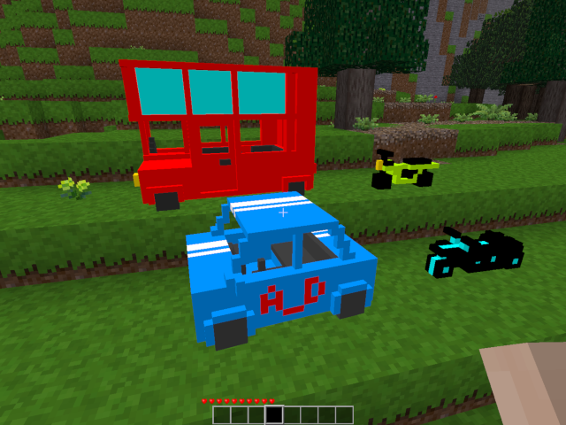

Mazewheel Version 1.00
======================

Overview
--------

Mazewheel is a mod that adds car, bike and bus to the Minetest game.  
You can ride them and run around the world.  

This is a fork by michyo from azewheel (by azekill_DIABLO).  
(Mazewheel GitHub repository: [https://github.com/michyo/mazewheel](https://github.com/michyo/mazewheel))  
(GitHub of original azewheel: [https://github.com/azekillDIABLO/azewheel](https://github.com/azekillDIABLO/azewheel))  

It has been modified so that you can use them everywhere, like on the dirt, sand, etc.  
And adjusted to work correctly in Minetest version 5.2.0.  

Screenshot
----------

Installation
------------

1. Download zip. ([https://github.com/michyo/mazewheel/archive/master.zip](https://github.com/michyo/mazewheel/archive/master.zip))  
2. Unpack it in one folder and put it in your Minetest mods folder.  
3. Enable it in the Minetest.  

Controls
--------

    Look around      : Move mouse  
    Move forwards    : W  
    Move to the left : A  
    Move backwards   : S  
    Move to the right: D  
    Put & collect    : Left mouse button  
    Getting on & off : Right mouse button  

Recipe
------

#### Car (mazewheel:car)

    ""             , ""            , ""  
    "default:steel", ""            , "default:steel"  
    "default:steel", "default:mese", "default:steel"  

#### Bike (mazewheel:bike)

    ""             , ""            , ""  
    "default:steel", ""            , "default:steel"  
    "default:steel", "default:mese", "default:steel"  

#### Bus (mazewheel:bus)

    "default:steel", "default:steel", "default:steel"  
    "default:steel", ""             , "default:steel"  
    "default:steel", "default:mese" , "default:steel"  

#### Night Shade (mazewheel:neonbike)

    ""             , ""            , ""  
    "default:steel", ""            , "default:steel"  
    "default:steel", "default:mese", "default:steel"  

Version History
---------------

#### 1.00 (2020/04/08):

* Initial release

License
-------

Copyright (C) 2020 michyo (Michiyo Tagami) [[https://michyo.net/](https://michyo.net/)]  

#### Code: WTFPL

    Original azewheel: PilzAdam,paramat and azekill_DIABLO  
    Mazewheel: michyo (Michiyo Tagami)  

#### Media: CC BY 3.0

    Textures: azekill_DIABLO  
    Models: azekill_DIABLO  

See the LICENSE.txt for more details.  
